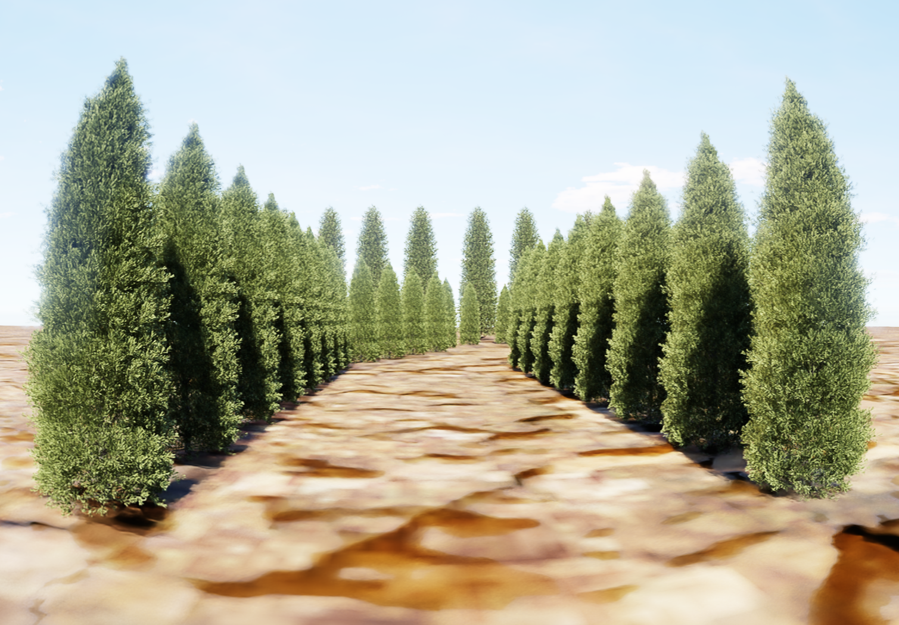

# agriculture_bot
A Segway Nova Carter robot simulation in Isaac Sim in an Agriculture Environment


## Overview
This project focuses on **autonomous navigation** in an agricultural setting. The robot operates in two modes:

1. **GPS-Based Navigation (Mapped Environment)**: The robot follows a pre-mapped path using GPS localization. The assumption is that a map can be generated through drone imaging.
2. **Visual Servoing (Unmapped Terrain)**: When no prior map is available, the robot uses visual servoing with image segmentation to navigate between plants and avoid obstacles.

## System Configuration
- **Simulator:** NVIDIA Isaac Sim 4.5
- **Middleware:** ROS2 Humble
- **Hardware:**
  - **GPU:** RTX 4070 (8GB VRAM)
  - **RAM:** 32GB
  - **CPU:** Intel i7

## Setup
First clone this repository, then the Isaac-Sim stage`.usd` file should be inside a folder `assets` like this:
 ``` bash
.
├── assets
│   └── Collected_world_flat
│       ├── SubUSDs
│       │   ├── materials
│       │   └── textures
│       └── world_flat.usd
├── build.sh
├── Dockerfile
├── humble_ws
│   └── src
│       ├── isaacsim
│       │   ├── CMakeLists.txt
│       │   ├── launch
│       │   │   └── run_isaacsim.launch.py
│       │   ├── package.xml
│       │   └── scripts
│       │       ├── open_isaacsim_stage.py
│       │       └── run_isaacsim.py
│       ├── navigation
│       │   ├── CMakeLists.txt
│       │   ├── launch
│       │   │   ├── isaacsim_navigation.launch.py
│       │   │   ├── isaacsim_visual_navigation.launch.py
│       │   │   ├── navigation.launch.py
│       │   │   └── visual_navigation.launch.py
│       │   ├── maps
│       │   │   ├── carter_outdoor_navigation.png
│       │   │   ├── carter_outdoor_navigation.yaml
│       │   │   ├── extended_outdoor_navigation.png
│       │   │   └── extended_outdoor_navigation.yaml
│       │   ├── navigation
│       │   │   ├── __init__.py
│       │   │   ├── navigate_through_poses.py
│       │   │   └── navigate_to_pose.py
│       │   ├── package.xml
│       │   ├── params
│       │   │   ├── global_navigation_params.yaml
│       │   │   ├── goals.txt
│       │   │   └── isaacsim.yaml
│       │   ├── resource
│       │   │   └── navigation
│       │   ├── rviz2
│       │   │   ├── global_navigation.rviz
│       │   │   └── navigation.rviz
│       │   ├── setup.cfg
│       │   └── setup.py
│       └── perception
│           ├── package.xml
│           ├── perception
│           │   ├── hsv_threshold.py
│           │   ├── __init__.py
│           │   ├── local_visual_navigation.py
│           │   └── visual_servoing.py
│           ├── resource
│           │   └── perception
│           ├── setup.cfg
│           ├── setup.py
│           └── test
│               ├── test_copyright.py
│               ├── test_flake8.py
│               └── test_pep257.py
├── imgs
│   ├── aerial_view.png
│   ├── agribot_camera.png
│   ├── agribot_camera_segmented.png
│   └── navigation.gif
├── README.md
├── run.sh
 ```

## Docker Setup
A **Dockerfile** is available to simplify setup. To build and run the container:
```bash
chmod u+x build.sh run.sh
./build.sh
./run.sh
```

## World Setup


As the isaacsim stage file, the one with the world environment and robot, are too large (>170MB), I will not include them in this repo. If you are interested let me known and I can share them.
Important to note that I did not developed the Nova_Carter_ROS robot file, I used from the IsaacSim tutorial.

## Running
First time running isaac sim you can run with:
```bash
./runapp.sh
```

and it can take some time, just ignore messages saying isaacsim is not responding and wait.

To run ROS2 :
```bash
cd /root/humble_ws/
colcon build
source install/setup.bash
```
### Global Navigation Example
After compiling ROS2
``` bash 
ros2 launch navigation isaacsim_navigation.launch.py
```

### Visual Navigation Example
``` bash 
ros2 launch navigation isaacsim_visual_navigation.launch.py
```

## References
### Instructions to setup Docker
Thanks [this repo](https://github.com/arambarricalvoj/nvidia_isaac-sim_ros2_docker) and this [forum](https://forums.developer.nvidia.com/t/docker-nvcr-io-nvidia-isaac-sim-4-5-0-cant-install-ros2-humble/323574)